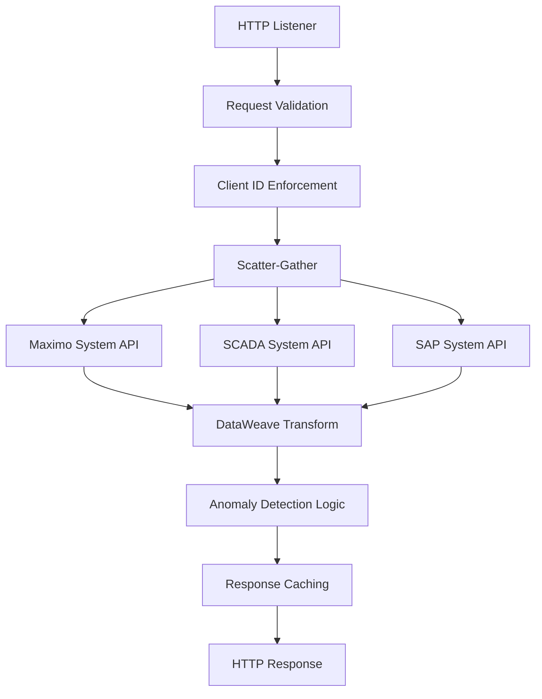

# Design Specification: Asset 360 Experience API

**Industry:** Energy / Oil & Gas (Upstream/Midstream)  
**Target Platform:** MuleSoft Anypoint Platform (CloudHub 2.0)  
**Runtime:** Mule 4.10  
**Consumer:** Salesforce Field Service (Lightning Web Components)  
**Version:** 1.0.0  
**Date:** December 2025  

---

## 1. Executive Summary

The Asset 360 Experience API provides field technicians with a unified, real-time view of critical infrastructure (e.g., wellhead pumps, pipeline compressors). By orchestrating data from SAP/Maximo (ERP) and SCADA/IoT platforms, this API eliminates "data silos" and enables proactive maintenance within the Salesforce UI.

### Business Value
- **Reduced Downtime:** Real-time anomaly detection prevents catastrophic equipment failures
- **Operational Efficiency:** Consolidated asset view eliminates manual data gathering across multiple systems  
- **Regulatory Compliance:** Centralized monitoring supports environmental and safety reporting requirements
- **Cost Optimization:** Predictive maintenance reduces emergency repair costs by up to 40%

---

## 2. Architectural Overview

This API follows the **API-led Connectivity** model to ensure reusability, security, and maintainability across the Energy sector's complex IT landscape.

### 2.1 Three-Layer Architecture

```
┌─────────────────────────────────────────────────────────┐
│                 EXPERIENCE LAYER                        │
│           Asset 360 Experience API (This API)          │
│     Tailored for Salesforce Field Service Mobile       │
└─────────────────────────────────────────────────────────┘
                              │
┌─────────────────────────────────────────────────────────┐
│                 PROCESS LAYER                           │
│         Asset Orchestration Process API                │
│    Business logic, data transformation, anomaly        │
│           detection, workflow orchestration             │
└─────────────────────────────────────────────────────────┘
                              │
┌─────────────────────────────────────────────────────────┐
│                 SYSTEM LAYER                            │
│  SAP System API │ Maximo System API │ SCADA System API  │
│     (ERP Data)   │  (Asset Mgmt)    │  (Real-time IoT)  │
└─────────────────────────────────────────────────────────┘
```

##:** Client ID Enforcement + OAuth 2.0
- **Monitoring:** Anypoint Monitoring with custom dashboards
- **Data Format:** JSON with OpenAPI 3.0 specification
- **Transport:** HTTPS with TLS 1.2+

---

## 3. Technical Interface Contract

### 3.1 Endpoint Specification

| Attribute | Value |
|-----------|-------|
| **Protocol** | HTTPS |
| **Base URL** | `https://asset-360-exp-api.us-e2.cloudhub.io/api/v1` |
| **Resource Path** | `/assets/{assetId}/detail` |
| **HTTP Method** | GET |
| **Content-Type** | application/json |
| **Authentication** | Client ID Enforcement via Salesforce Named Credentials |

### 3.2 Request Parameters

| Parameter | Type | Location | Required | Format | Description |
|-----------|------|----------|----------|---------|-------------|
| `assetId` | String | Path | Yes | Salesforce ID format | The Salesforce Asset Record ID (e.g., `02i8W000000xxxxx`) |

### 3.3 Response Schema

The response is optimized for a "Header-Detail" dashboard view in Salesforce Field Service Mobile.

```json
{
  "assetSummary": {
    "assetId": "02i8W000000xxxxx",
    "name": "ESP-Pump-01",
    "currentStatus": "Optimal|Warning|Critical",
    "lastRunHours": 1450.5,
    "currentPressurePsi": 850.2,
    "operationalRegion": "Permian Basin",
    "flaggedAlerts": 2,
    "location": {
      "latitude": 31.8457,
      "longitude": -102.3676,
      "wellSite": "Site-Alpha-7"
    },
    "lastMaintenance": "2025-11-15T10:30:00Z",
    "nextScheduledMaintenance": "2025-12-20T08:00:00Z"
  },
  "sensorReadings": [
    {
      "readingId": "sensor_001_20251217_143022",
      "timestamp": "2025-12-17T14:30:22.000Z",
      "pressurePsi": 850.2,
      "temperatureC": 110.5,
      "vibrationRMS": 0.45,
      "flowRateGPM": 125.8,
      "powerConsumptionKW": 45.2,
      "isAnomaly": false,
      "alertThreshold": {
        "pressureMax": 900.0,
        "temperatureMax": 120.0,
        "vibrationMax": 1.0
      }
    }
  ],
  "metadata": {
    "responseTime": "2025-12-17T14:30:25.123Z",
    "dataSourcesQueried": ["Maximo", "SCADA", "SAP"],
    "cacheStatus": "FRESH"
  }
}
```

### 3.4 Status Codes & Error Handling

| HTTP Code | Description | Response Body |
|-----------|-------------|---------------|
| 200 | Success | Complete asset detail response |
| 400 | Bad Request | `{"error": "Invalid assetId format", "code": "INVALID_ASSET_ID"}` |
| 401 | Unauthorized | `{"error": "Invalid client credentials", "code": "AUTH_FAILED"}` |
| 404 | Not Found | `{"error": "Asset not found", "code": "ASSET_NOT_FOUND"}` |
| 500 | Internal Server Error | `{"error": "Downstream system unavailable", "code": "SYSTEM_ERROR"}` |
| 503 | Service Unavailable | `{"error": "Rate limit exceeded", "code": "RATE_LIMIT_EXCEEDED"}` |

---

## 4. Implementation Logic (Mule 4.10)

### 4.1 Flow Architecture



### 4.2 Key Implementation Components

#### 4.2.1 Orchestration Pattern
```xml
<scatter-gather doc:name="Parallel Data Retrieval">
    <route>
        <flow-ref doc:name="Get Asset Metadata" doc:id="maximo-flow"/>
    </route>
    <route>
        <flow-ref doc:name="Get Real-time Telemetry" doc:id="scada-flow"/>
    </route>
    <route>
        <flow-ref doc:name="Get ERP Data" doc:id="sap-flow"/>
    </route>
</scatter-gather>
```

#### 4.2.2 DataWeave Transformation
```dataweave
%dw 2.0
output application/json
var assetMetadata = payload[0]
var telemetryData = payload[1]
var erpData = payload[2]
---
{
    assetSummary: {
        assetId: vars.assetId,
        name: assetMetadata.name,
        currentStatus: if(telemetryData.anomalyDetected) "Critical" 
                      else if(telemetryData.warningThreshold) "Warning" 
                      else "Optimal",
        lastRunHours: assetMetadata.totalRuntime,
        currentPressurePsi: telemetryData.pressure,
        operationalRegion: assetMetadata.location.region,
        flaggedAlerts: telemetryData.activeAlerts
    },
    sensorReadings: telemetryData.readings map ((reading, index) -> {
        readingId: reading.id,
        timestamp: reading.timestamp,
        pressurePsi: reading.pressure,
        temperatureC: reading.temperature,
        vibrationRMS: reading.vibration,
        isAnomaly: reading.pressure > 900 or reading.temperature > 120 or reading.vibration > 1.0
    })
}
```

#### 4.2.3 Anomaly Detection Logic
```dataweave
%dw 2.0
fun detectAnomalies(reading) = 
    reading.pressurePsi > 900 or 
    reading.temperatureC > 120 or 
    reading.vibrationRMS > 1.0

fun calculateStatus(readings) = 
    if(readings some $.isAnomaly) "Critical"
    else if(readings some ($.pressurePsi > 850 or $.temperatureC > 100)) "Warning"
    else "Optimal"
```

---

## 5. Security & Governance

### 5.1 Security Layers
- **Transport Security:** TLS 1.2+ encryption for all communications
- **API Security:** Client ID Enforcement with API Key rotation
- **Authentication:** OAuth 2.0 integration with Salesforce Named Credentials
- **Authorization:** Role-based access control (RBAC) for different user types
- **Data Protection:** Sensitive field masking for non-authorized users

### 5.2 Governance Policies
- **Rate Limiting:** 100 requests per minute per client to protect legacy SCADA systems
- **Throttling:** Spike control to prevent "noisy neighbor" scenarios
- **Logging:** Comprehensive audit trail for regulatory compliance
- **Monitoring:** Real-time alerts for SLA violations

### 5.3 Compliance Considerations
- **Data Retention:** 7-year retention policy for audit trails
- **Privacy:** PII data handling in compliance with industry regulations
- **Environmental Reporting:** Data lineage tracking for EPA/environmental compliance

---

## 6. Performance & Scalability

### 6.1 Performance Requirements
- **Response Time:** < 500ms for 95th percentile
- **Throughput:** Support 1000+ concurrent field technicians
- **Availability:** 99.9% uptime SLA
- **Cache Strategy:** 5-minute TTL for real-time telemetry, 30-minute TTL for asset metadata

### 6.2 Scalability Design
- **Auto-scaling:** CloudHub 2.0 automatic replica scaling based on CPU/memory utilization
- **Load Balancing:** Built-in load balancing across multiple workers
- **Circuit Breaker:** Fault tolerance for downstream system failures
- **Bulkhead Pattern:** Isolated thread pools for different downstream systems

---

## 7. Deployment & DevOps

### 7.1 Deployment Architecture
```yaml
Environment: CloudHub 2.0
Runtime: Mule 4.10
Worker Size: 1 vCore
Replicas: 2 (minimum for HA)
Region: US-East-2
Network: Private Space (for enhanced security)
```

### 7.2 CI/CD Pipeline
1. **Source Control:** Git-based version control with feature branching
2. **Build:** Automated builds with dependency vulnerability scanning
3. **Test:** Unit tests, integration tests, and contract testing
4. **Deploy:** Blue-green deployment strategy for zero-downtime releases
5. **Monitor:** Post-deployment health checks and rollback procedures

### 7.3 Monitoring & Observability

#### 7.3.1 Key Metrics
- **Business Metrics:** API adoption, data accuracy, field technician productivity
- **Technical Metrics:** Response time, error rate, throughput
- **Infrastructure Metrics:** CPU, memory, network utilization

#### 7.3.2 Alerting Rules
- **Critical:** API error rate > 5% or response time > 2 seconds
- **Warning:** Downstream system response time > 1 second
- **Info:** New deployment or configuration change notifications

---

## 8. Integration Patterns

### 8.1 Salesforce Integration
```javascript
// Lightning Web Component consumption example
import { LightningElement, api, track } from 'lwc/core';
import getAssetDetail from '@salesforce/apex/AssetController.getAssetDetail';

export default class Asset360Dashboard extends LightningElement {
    @api recordId;
    @track assetData;
    @track loading = true;

    async connectedCallback() {
        try {
            this.assetData = await getAssetDetail({ assetId: this.recordId });
            this.loading = false;
        } catch (error) {
            console.error('Error loading asset data:', error);
        }
    }
}
```

### 8.2 Error Handling Strategy
```xml
<error-handler>
    <on-error-propagate enableNotifications="true" logException="true" type="HTTP:TIMEOUT">
        <set-payload value='#[{error: "Downstream system timeout", code: "TIMEOUT_ERROR"}]'/>
        <set-variable variableName="httpStatus" value="503"/>
    </on-error-propagate>
    <on-error-propagate enableNotifications="true" logException="true" type="HTTP:CONNECTIVITY">
        <set-payload value='#[{error: "System connectivity issue", code: "CONNECTIVITY_ERROR"}]'/>
        <set-variable variableName="httpStatus" value="502"/>
    </on-error-propagate>
</error-handler>
```

---

## 9. Data Models

### 9.1 Asset Summary Model
```json
{
  "assetId": "String (Salesforce ID)",
  "name": "String (Asset name/identifier)",
  "currentStatus": "Enum [Optimal, Warning, Critical]",
  "lastRunHours": "Number (cumulative runtime)",
  "currentPressurePsi": "Number (current pressure reading)",
  "operationalRegion": "String (geographic region)",
  "flaggedAlerts": "Number (count of active alerts)",
  "location": "Object (GPS coordinates and site info)",
  "lastMaintenance": "ISO 8601 DateTime",
  "nextScheduledMaintenance": "ISO 8601 DateTime"
}
```

### 9.2 Sensor Reading Model
```json
{
  "readingId": "String (unique identifier)",
  "timestamp": "ISO 8601 DateTime",
  "pressurePsi": "Number (pressure in PSI)",
  "temperatureC": "Number (temperature in Celsius)",
  "vibrationRMS": "Number (vibration RMS value)",
  "flowRateGPM": "Number (flow rate in GPM)",
  "powerConsumptionKW": "Number (power consumption)",
  "isAnomaly": "Boolean (anomaly flag)",
  "alertThreshold": "Object (threshold values for alerting)"
}
```

---

## 10. Testing Strategy

### 10.1 Test Pyramid
- **Unit Tests:** DataWeave transformations, utility functions (80% coverage)
- **Integration Tests:** End-to-end API flows with mocked downstream systems
- **Contract Tests:** API specification compliance using Pact
- **Performance Tests:** Load testing with realistic field usage patterns

### 10.2 Test Data Management
- **Synthetic Data:** Generated test data for development and testing environments
- **Data Masking:** Production-like data with sensitive information masked
- **Test Scenarios:** Edge cases, error conditions, and boundary value testing

---

## 11. Future Enhancements

### 11.1 Roadmap (Next 6 Months)
- **Predictive Analytics:** ML-based failure prediction algorithms
- **Historical Trends:** Time-series data analysis endpoints
- **Bulk Operations:** Multi-asset querying capabilities
- **Mobile Optimization:** Offline capability for field technicians

### 11.2 Advanced Features (12+ Months)
- **Digital Twin Integration:** 3D asset visualization data
- **Augmented Reality:** AR overlays for field maintenance
- **Voice Integration:** Voice-activated queries through Salesforce Einstein
- **Blockchain Integration:** Immutable maintenance records

---

**Document Version:** 1.0.0  
**Last Updated:** December 17, 2025  
**Next Review:** March 17, 2026  
**Owner:** API Architecture Team  
**Stakeholders:** Field Service Operations, IT Security, Compliance Team
